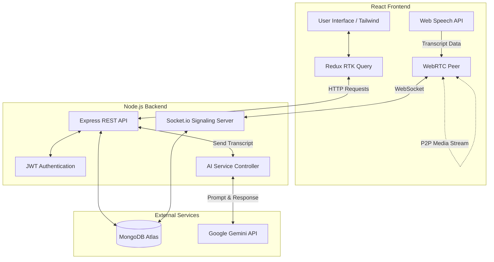

# IntellMeet - AI-Powered Enterprise Meeting & Collaboration Platform
**Internship Project Report**

## 1. Executive Summary
IntellMeet is a next-generation, browser-based video conferencing platform designed to streamline remote collaboration. Built as an internship capstone project, the platform integrates real-time WebRTC mesh networking with cutting-edge Google Gemini AI to provide live transcriptions, automated intelligent meeting summaries, and robust participant management. 

## 2. Project Overview

### Vision & Objectives
To build a premium, low-latency video conferencing tool that goes beyond standard communication by leveraging AI to eliminate the need for manual meeting notes, allowing participants to focus entirely on the conversation.

### Target Users / Use Cases
*   **Remote Teams & Enterprises:** Daily standups, sprint planning, and highly collaborative discussions.
*   **Educators & Students:** Remote lectures requiring auto-generated summaries and live captions.
*   **Freelancers & Consultants:** Client meetings where automatic transcription and action-item extraction are highly valuable.

### Business Value Delivered
*   **Time Efficiency:** Saves an average of 15-30 minutes per meeting by automating the summarization and action-item generation process.
*   **Accessibility:** Live transcriptions allow hard-of-hearing users or non-native speakers to follow along easily.
*   **Cost Reduction:** Eliminates the need for paid third-party AI note-taking bots (like Otter.ai) by natively integrating free-tier Google Gemini AI.

### Non-Functional Goals
*   **Latency:** Sub-200ms audio/video latency via WebRTC peer-to-peer mesh networking.
*   **Concurrency:** Supports smooth multi-party calls (up to 16 active video streams optimally).
*   **Availability:** High availability API backend with automated MongoDB reconnects and graceful error handling.

---

## 3. Key Features

| ID | Feature | Description | Acceptance Criteria |
| :--- | :--- | :--- | :--- |
| **F01** | **Secure Auth** | JWT-based user authentication and registration. | Users can securely sign up, log in, and maintain a persistent session across reloads. |
| **F02** | **P2P Video Calling** | Real-time WebRTC mesh network for video/audio. | Users can join a room by code and instantly see/hear other participants. |
| **F03** | **Media Controls** | Mute/Unmute, Video On/Off, and Screen Sharing. | Users can toggle hardware devices instantly. Screen share replaces the video track dynamically. |
| **F04** | **Live Transcription** | Native browser Speech Recognition overlay. | Live subtitles appear on screen as users speak, stamped with their name. |
| **F05** | **AI Meeting Summaries** | Google Gemini AI integration. | Upon meeting end, the host triggers an API call that digests the full transcript and saves a Markdown-formatted summary. |
| **F06** | **Summary Dashboard** | A dedicated UI to view past meetings. | Users can view AI summaries, raw transcripts, and attendee lists for past meetings. |
| **F07** | **Host Controls** | Meeting moderation and security. | Host can mute all, kick users, control recording permissions, and permanently delete meeting records. |

---

## 4. Technology Stack

| Category | Technology | Rationale / Alternatives Considered |
| :--- | :--- | :--- |
| **Frontend Framework** | React.js (Vite) | Chosen for high performance, modular component architecture, and fast HMR over CRA or Angular. |
| **State Management** | Redux Toolkit (RTK Query) | Provides excellent built-in caching, automatic re-fetching, and clean API slice management over raw Context API. |
| **Styling** | Tailwind CSS v4 | Rapid utility-first styling for premium UI/UX, dark-mode toggling, and fully responsive layouts. |
| **Real-time Signaling** | Socket.io | Reliable WebSocket wrapper for WebRTC signaling (Offer/Answer/ICE) with auto-reconnection. |
| **Video Networking** | WebRTC (Native) | Zero-dependency, low-latency peer-to-peer media streaming. Chosen over SFU (like mediasoup) to reduce server costs. |
| **Backend API** | Node.js & Express.js | Fast, unopinionated Javascript runtime to match the frontend stack (MERN). |
| **Database** | MongoDB & Mongoose | Flexible NoSQL schema ideal for storing complex, nested meeting transcripts and user profiles. |
| **AI Integration** | Google Generative AI (Gemini) | Used `gemini-flash-latest` for ultra-fast, free-tier intelligent text summarization over OpenAI API (paid). |

---

## 5. Architecture Diagram

### Flow Summary:
1. **Signaling:** Client connects to Socket.io to exchange SDP offers/answers.
2. **Media:** Once negotiated, WebRTC establishes a direct P2P connection between browsers.
3. **Transcription:** The browser's native Speech API captures text and sends it over Socket.io to sync with peers.
4. **AI Processing:** When the call ends, the transcript is sent via REST API to the Node backend, which queries Google Gemini, saves the summary to MongoDB, and returns it to the client.

---

## 6. Detailed Execution Timeline

| Week | Phase | Tasks Completed |
| :--- | :--- | :--- |
| **Week 1** | Project Setup & Auth | Repository initialization, Vite + React setup, Node/Express server setup, MongoDB connection, JWT User Authentication. |
| **Week 2** | Signaling & WebRTC Core | Socket.io integration, WebRTC Peer Connection logic, ICE candidate negotiation, Basic 1-to-1 video stream testing. |
| **Week 3** | Mesh Networking & UI | Scaling WebRTC to Mesh (N-to-N), designing the dark-mode premium UI, responsive Video Grid, Control Bar components. |
| **Week 4** | Advanced Media & Features | Screen sharing integration, local recording, Host moderation controls (Mute All, Kick), participant sidebar. |
| **Week 5** | AI & Transcription | Web Speech API integration for live captions, accumulating transcript data, integrating Google Generative AI SDK (`gemini-flash-latest`). |
| **Week 6** | Polish & Dashboard | Building the Meeting History Dashboard, Markdown rendering for AI summaries, light/dark mode fixes, mobile responsiveness, final bug squashing. |
